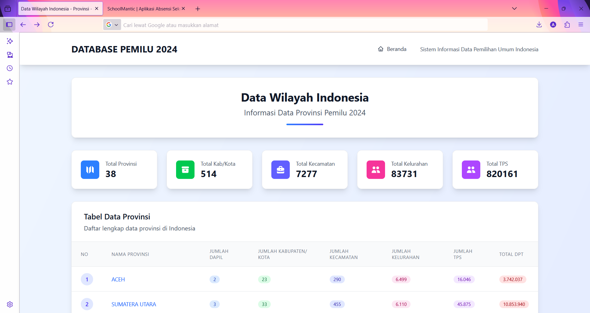
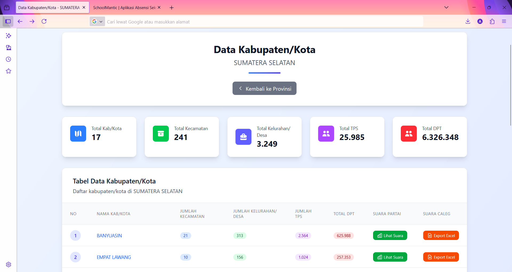
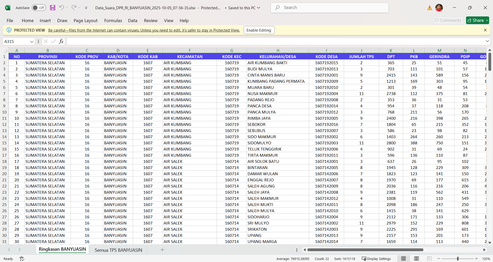
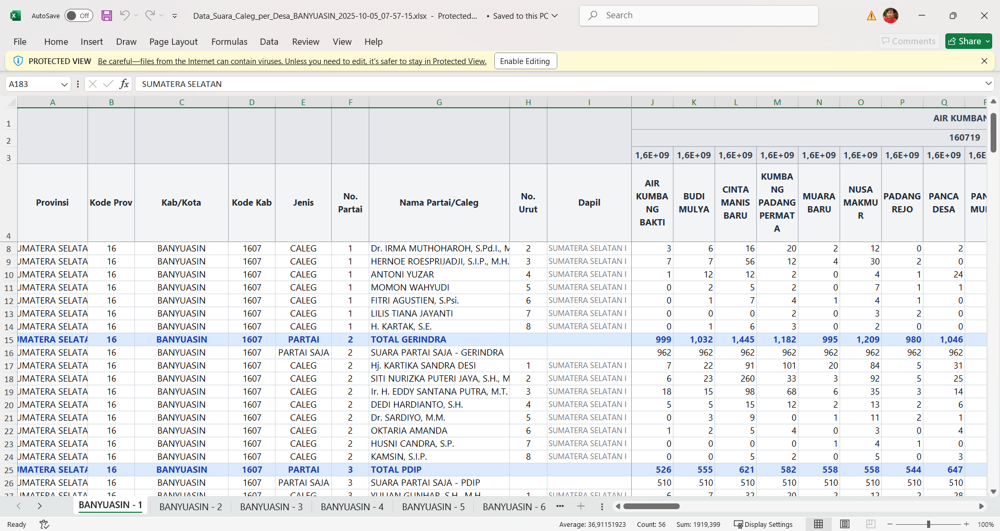

# Database Pemilu 2024

<div align="center">
  <h3>Sistem Informasi Data Pemilihan Umum Indonesia 2024</h3>
  <p>Web aplikasi untuk menampilkan dan mengelola data pemilihan umum DPR RI tahun 2024</p>

  [](https://laravel.com)
  [](https://vuejs.org)
  [](https://inertiajs.com)
  [](https://tailwindcss.com)
</div>

---

## 📸 Screenshots

### 1. Halaman Utama - Data Provinsi

*Menampilkan data 38 provinsi aktif dengan statistik lengkap: Total Kab/Kota, Kecamatan, Kelurahan/Desa, TPS, dan Total DPT*

### 2. Halaman Data Kabupaten/Kota

*Detail data kabupaten/kota per provinsi dengan tombol export dan lihat suara*

### 3. Export Excel - Data Suara DPR per TPS

*Export data suara DPR RI per TPS dengan detail lengkap per kelurahan/desa*

### 4. Export Excel - Data Suara Caleg per Desa

*Export data suara caleg dengan breakdown per desa, multi-sheet, dan warna highlight untuk baris PARTAI*

---

## ✨ Fitur Utama

### 📊 Tampilan Data
- **Data Hierarki Wilayah**: Provinsi → Kabupaten/Kota → Kecamatan → Kelurahan/Desa → TPS
- **Statistik Real-time**: Jumlah TPS, DPT, Kecamatan, dan Kelurahan per wilayah
- **Filter Data Aktif**: Hanya menampilkan 38 provinsi aktif (tanpa "Luar Negeri")
- **Navigasi Breadcrumb**: Kemudahan navigasi antar halaman
- **Responsive Design**: Tampilan optimal di desktop, tablet, dan mobile

### 📥 Export Excel
- **Export Data Suara DPR**: Data suara per kabupaten dengan multi-sheet
- **Export Data Caleg per Desa**:
  - Data suara caleg dengan granularitas per desa/kelurahan
  - Header 4-row: Kecamatan → Kode Kecamatan → Kode Desa → Nama Desa
  - Auto-split multi-sheet (50 desa per sheet)
  - Warna highlight untuk baris PARTAI dan TOTAL
  - Format angka dengan ribuan separator
  - Freeze panes untuk navigasi optimal
- **Export Data TPS**: Data suara per TPS dengan detail lengkap

### 🎨 Visual & UX
- **Modern UI**: Design clean dengan Tailwind CSS
- **Animasi Smooth**: Menggunakan VueUse Motion
- **Color Coding**: Warna berbeda untuk setiap kategori data
- **Loading States**: Indikator loading yang jelas
- **Changelog Page**: Dokumentasi perubahan dan fitur baru

---

## 🚀 Teknologi

### Backend
- **Laravel 11/12**: Framework PHP modern dengan fitur terbaru
- **MySQL**: Database relational untuk data pemilu
- **Maatwebsite Excel**: Library untuk export data ke Excel

### Frontend
- **Vue.js 3**: Progressive JavaScript framework dengan Composition API
- **Inertia.js**: Modern monolith framework untuk SPA experience
- **Tailwind CSS**: Utility-first CSS framework
- **VueUse Motion**: Animation library untuk Vue.js

---

## 📦 Instalasi

### Prasyarat
- PHP >= 8.1
- Composer
- Node.js & NPM
- MySQL >= 8.0

### Langkah Instalasi

1. **Clone Repository**
   ```bash
   git clone https://github.com/aswandi/data-pemilu-2024.git
   cd data-pemilu-2024
   ```

2. **Install Dependencies**
   ```bash
   composer install
   npm install
   ```

3. **Setup Environment**
   ```bash
   cp .env.example .env
   php artisan key:generate
   ```

4. **Konfigurasi Database**

   Edit file `.env`:
   ```env
   DB_CONNECTION=mysql
   DB_HOST=127.0.0.1
   DB_PORT=3306
   DB_DATABASE=pileg2024
   DB_USERNAME=root
   DB_PASSWORD=your_password
   ```

5. **Import Database**

   Database schema sudah tersedia. Import data pemilu ke database MySQL Anda.

6. **Build Assets**
   ```bash
   npm run build
   ```

7. **Jalankan Aplikasi**
   ```bash
   php artisan serve
   ```

   Aplikasi dapat diakses di: `http://localhost:8000`

---

## 📁 Struktur Database

### Tabel Wilayah (Regional)
- `pdpr_wil_pro` - Data Provinsi
- `pdpr_wil_kab` - Data Kabupaten/Kota
- `pdpr_wil_kec` - Data Kecamatan
- `pdpr_wil_kel` - Data Kelurahan/Desa
- `pdpr_wil_tps` - Data TPS (Tempat Pemungutan Suara)
- `pdpr_wil_dapil` - Data Daerah Pemilihan

### Tabel Kandidat
- `dpr_ri_caleg` - Calon Legislatif DPR RI
- `dprd_pro_caleg` - Calon Legislatif DPRD Provinsi
- `dprd_kab_caleg` - Calon Legislatif DPRD Kabupaten/Kota
- `dpd_caleg` - Calon Legislatif DPD

### Tabel Hasil Suara
- `hr_dpr_ri_kec` - Hasil suara DPR RI per kecamatan
- `hs_dpr_ri_tps` - Hasil suara DPR RI per TPS
- `hs_dpr_ri_kel` - Hasil suara DPR RI per kelurahan

---

## 🎯 Fitur Unggulan Export Excel

### Data Suara Caleg per Desa
Export data dengan fitur:
- ✅ **Granularitas Per Desa**: Data vote per desa/kelurahan
- ✅ **Header Hierarkis**: 4-row header dengan kecamatan dan kode wilayah
- ✅ **Multi-sheet Smart**: Auto-split 50 desa per sheet
- ✅ **Visual Highlight**:
  - Baris PARTAI: Background biru muda + teks biru gelap
  - Baris TOTAL: Background kuning + teks coklat
- ✅ **Format Professional**: Ribuan separator, freeze panes, merge cells
- ✅ **Sheet Summary**: Sheet terakhir dengan kolom Total Suara

### Data Suara DPR per TPS
Export data dengan:
- ✅ **Detail Per TPS**: Data lengkap setiap TPS di kecamatan
- ✅ **Suara Partai**: Kolom terpisah untuk suara partai
- ✅ **Suara Caleg**: Kolom per kandidat sesuai dapil
- ✅ **Statistik**: Total suara dan partisipasi pemilih

---

## 📝 Changelog

### Version 1.3.4 (5 Oktober 2025)
- Export Excel data suara caleg per desa dengan visual enhancement
- Header 4-row: Kecamatan → Kode Kec → Kode Desa → Nama Desa
- Warna highlight untuk baris PARTAI dan TOTAL
- Auto-split multi-sheet dengan 50 desa per sheet
- Memory optimization untuk handle 150+ desa

---

## 🤝 Kontribusi

Kontribusi selalu diterima! Silakan buat issue atau pull request untuk perbaikan dan fitur baru.

---

## 📄 Lisensi

Project ini dibuat untuk keperluan pendidikan dan transparansi data pemilu Indonesia.

---

## 👨‍💻 Developer

Dikembangkan dengan ❤️ menggunakan Laravel, Vue.js, dan Inertia.js

🤖 *Generated with [Claude Code](https://claude.com/claude-code)*

---

## 📞 Kontak

- **WhatsApp**: [+62 811-945-222](https://wa.me/62811945222)
- **Website**: [www.aswandi.or.id](https://www.aswandi.or.id)
- **Repository**: [https://github.com/aswandi/data-pemilu-2024](https://github.com/aswandi/data-pemilu-2024)
